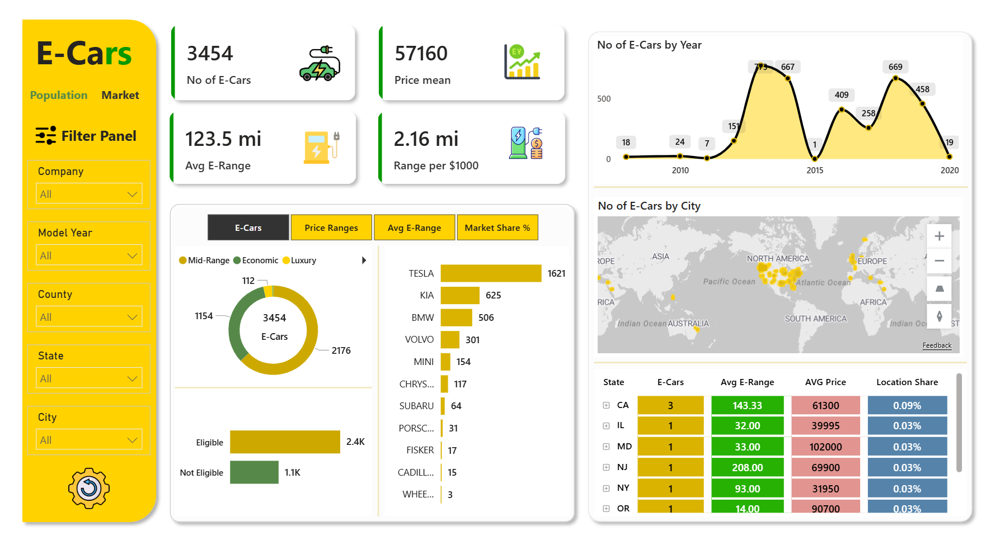
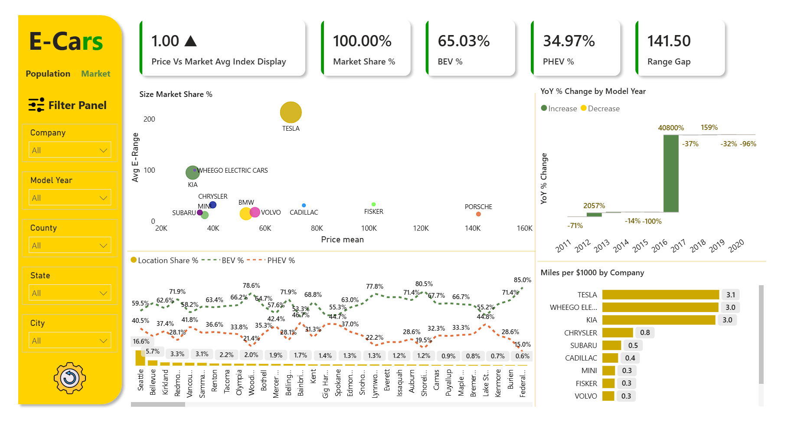
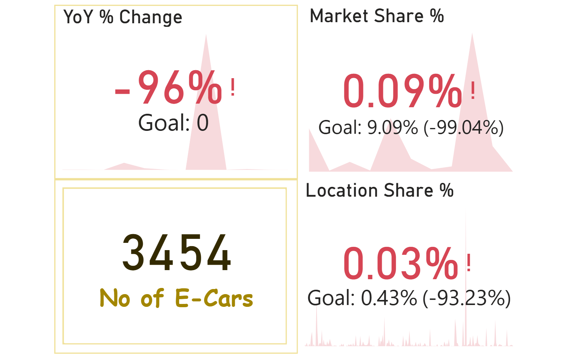
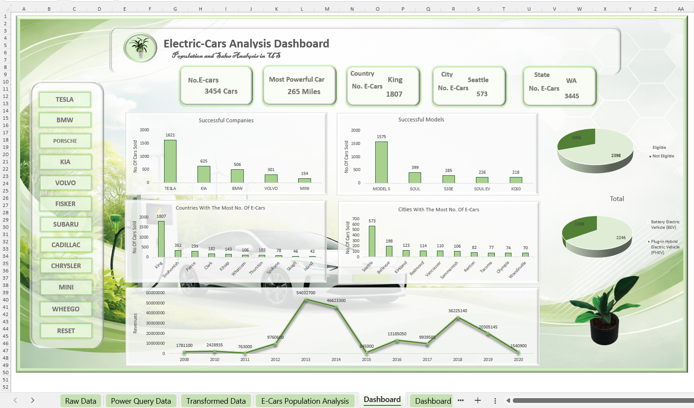
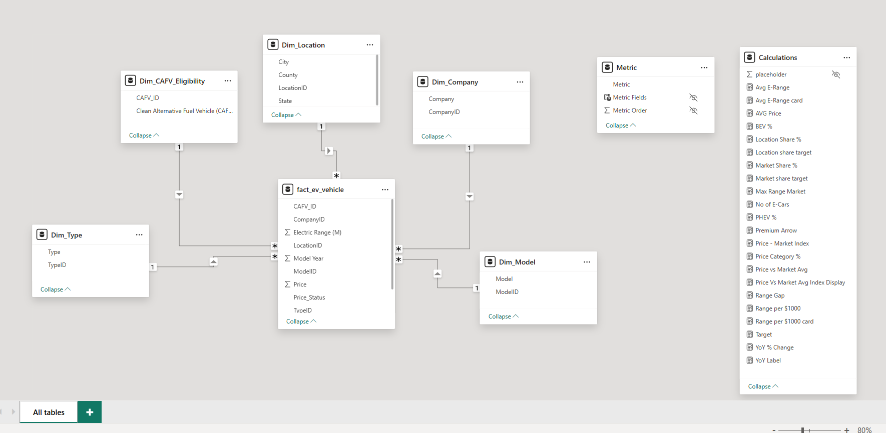

# EV Population & Market Analytics


A comprehensive electric vehicle (EV) analytics solution designed to evaluate market concentration, pricing segmentation, technology architecture, policy eligibility, and geographic adoption patterns across Washington State (99.74% of the dataset) using SQL Server, Power BI, Excel, and dimensional modeling (Star Schema).

---

## Navigation Pane

- **New to this project?** → [Getting Started](#getting-started)
- **Want dashboards?** → [Dashboards](#dashboards)
- **Interested in the data model?** → [Data Model](#data-model)
- **Looking for insights?** → [Key Insights](#key-insights)
- **Interested in SQL analysis?** → [SQL Queries](#sql-queries)
- **Want the strategic takeaways?** → [Business Recommendations](#business-recommendations)
- **Need tech details?** → [Tech Stack](#tech-stack)
- **Looking for resources?** → [Reference Resources](#reference-resources)
- **Contact information?** → [Support & Contact](#support--contact)

---

## Project Overview

This project transforms raw EV registration and pricing data into executive-level business intelligence that informs policy planning, automaker strategy, and energy infrastructure decisions.

**Key Metrics:**
- **3,454** Total EVs in Dataset
- **46.93%** Tesla Market Share (Leading Brand)
- **79.68%** Top 3 Brand Share
- **65.03%** BEV Share
- **69.43%** CAFV Eligible Share
- **52.32%** King County Concentration

---

## Dashboards

### 1. Population Dashboard


**Purpose:** High-level KPI overview of the EV population — brand share, price segment mix, and technology architecture
**Key Metrics:** Total EVs, Brand Market Share, BEV/PHEV Split, Price Segment Distribution, CAFV Eligibility

---

### 2. Market Dashboard


**Purpose:** Deep dive into geographic concentration and market share by location
**Key Metrics:** County/City Breakdown, Market Share %, Location Share Target, Range Comparisons

---

### 3. Tooltip Dashboard


**Purpose:** Contextual drill-down details on hover, surfacing metric-level detail without cluttering the main views
**Key Metrics:** Avg E-Range, Avg Price, Range per $1000, Price vs Market Index

---

### 4. Excel Interactive Dashboard


**Purpose:** Self-service analytics with dynamic filtering
**Features:** Pivot tables, combo charts, slicers (Company, Model, Type, County, CAFV Eligibility)

---

## Data Model



**Architecture (Star Schema):**

| Table | Type | Purpose |
|---|---|---|
| `fact_ev_vehicle` | Fact | Transactional data — one row per vehicle registration |
| `Dim_Company` | Dimension | Brand/manufacturer attributes |
| `Dim_Model` | Dimension | Model-level categorization |
| `Dim_Location` | Dimension | City, County, State attributes |
| `Dim_Type` | Dimension | BEV / PHEV powertrain type |
| `Dim_CAFV_Eligibility` | Dimension | Clean Alternative Fuel Vehicle eligibility status |
| `Metric` / `Calculations` | Measure Tables | Centralized DAX measures (Market Share %, BEV %, Range per $1000, YoY % Change, etc.) |

---

## Key Insights

### 1. Market Concentration (Brand Performance)

| Company | No. of EVs | Share | Total Price |
|---|---|---|---|
| **Tesla** | **1,621** | **46.93%** | $113,626,550 |
| Kia | 625 | 18.09% | $20,162,350 |
| BMW | 506 | 14.65% | $26,748,400 |
| Volvo | 301 | 8.71% | $16,923,050 |
| Mini | 154 | 4.46% | $5,677,300 |

**Insight:** Tesla alone is 2.6x the size of Kia and 3.2x the size of BMW. The top 3 brands (Tesla, Kia, BMW) control 79.68% of the dataset, while the top 5 reach 92.85% — a leader-led market with clear concentration risk rather than a fragmented one. Model-level dependency mirrors this: Model S alone contributes 45.60% of all vehicles, and the top 3 models together account for 65.40%.

---

### 2. Product Mix & Price Segments

| Price Segment | No. of EVs | Share |
|---|---|---|
| **Mid-Range** | **2,176** | **63.00%** |
| Economic | 1,154 | 33.41% |
| Luxury | 112 | 3.24% |
| Super-Luxury | 12 | 0.35% |

**Insight:** Mid-range and economic vehicles combine for 96.41% of the fleet, while luxury and super-luxury remain statistically negligible. Adoption in this dataset is driven by pricing accessibility and mainstream affordability, not premium experimentation.

---

### 3. Vehicle Technology & CAFV Eligibility

| Type | No. of EVs | Share | Total Range (mi) |
|---|---|---|---|
| **BEV** | **2,246** | **65.03%** | 405,515 |
| PHEV | 1,208 | 34.97% | 21,059 |

| CAFV Eligibility | No. of EVs | Share |
|---|---|---|
| **Eligible** | **2,398** | **69.43%** |
| Not Eligible | 1,056 | 30.57% |

**Insight:** BEVs dominate both unit count and total range volume, signaling a market trending toward full electrification rather than transition-stage hybrid dependence. CAFV-eligible vehicles account for 69.43% of records and carry the clear range advantage — policy-qualified vehicles are both more common and technologically stronger in practical terms.

---

### 4. Geographic Distribution

| County | No. of EVs | Share |
|---|---|---|
| **King** | **1,807** | **52.32%** |
| Snohomish | 352 | 10.19% |
| Pierce | 299 | 8.66% |
| Clark | 182 | 5.27% |
| Kitsap | 143 | 4.14% |

**Top Cities:** Seattle (573) · Bellevue (198) · Kirkland (123) · Redmond (114) · Vancouver (110)

**Insight:** Washington State holds 99.74% of the entire population. Within the state, King County alone contributes 52.32%, and the top 3 counties (King, Snohomish, Pierce) reach 71.16%. The practical addressable market is clustered around the Seattle metro — infrastructure, dealer strategy, and marketing should be optimized for regional density rather than broad-state uniformity.

---

### 5. Model-Year Momentum & YoY Change

| Year | EV Count | YoY Change |
|---|---|---|
| 2010 | 24 | — |
| 2011 | 7 | -70.8% |
| 2012 | 151 | +2,057.1% |
| 2013 | 715 | +373.5% |
| 2014 | 617 | -13.7% |
| 2015 | 1 | -99.8% |
| 2016 | 409 | +40,800.0% |
| 2017 | 258 | -36.9% |
| 2018 | 669 | +159.3% |
| 2019 | 458 | -31.5% |
| 2020 | 19 | -95.9% |

**Insight:** 2012 was the break-out year (+2,057.1% from a small 2011 base), and 2013 delivered the strongest expansion by absolute volume (+373.5%). The 2015 collapse to 1 unit and the 2020 drop to 19 units are not consistent with normal market evolution and are flagged as likely data-coverage or extraction artifacts — the yearly chart should be used to discuss adoption phases and anomalies, not as a stable forecasting time series.

---

## SQL Queries

### 1. Brand Market Concentration with Cumulative Share (Window Functions + CTE)
```sql
WITH Brand_Summary AS (
    SELECT
        dc.Company,
        COUNT(fe.CompanyID) AS No_of_EVs,
        SUM(fe.Price) AS Total_Price
    FROM fact_ev_vehicle fe
    INNER JOIN Dim_Company dc
        ON fe.CompanyID = dc.CompanyID
    GROUP BY dc.Company
)
SELECT
    Company,
    No_of_EVs,
    Total_Price,
    ROUND(No_of_EVs * 100.0 / SUM(No_of_EVs) OVER (), 2) AS Market_Share_Pct,
    ROUND(SUM(No_of_EVs) OVER (ORDER BY No_of_EVs DESC
          ROWS UNBOUNDED PRECEDING) * 100.0
          / SUM(No_of_EVs) OVER (), 2) AS Cumulative_Share_Pct,
    RANK() OVER (ORDER BY No_of_EVs DESC) AS Brand_Rank
FROM Brand_Summary
ORDER BY No_of_EVs DESC;
```
**Output:** Tesla ranks #1 with 46.93% share; cumulative share crosses 79.68% at rank 3 (Tesla, Kia, BMW), confirming the top-3 concentration threshold.

---

### 2. Price Segment Analysis vs. Market Average (Subquery + Window Function)
```sql
SELECT
    fe.Price_Status,
    COUNT(*) AS No_of_EVs,
    ROUND(COUNT(*) * 100.0 / SUM(COUNT(*)) OVER (), 2) AS Share_Pct,
    ROUND(AVG(fe.Price), 2) AS Avg_Segment_Price,
    ROUND(AVG(fe.Price) - (SELECT AVG(Price) FROM fact_ev_vehicle), 2)  AS Price_Diff_vs_Market_Avg,
    NTILE(4) OVER (ORDER BY AVG(fe.Price)) AS Price_Quartile
FROM fact_ev_vehicle fe
GROUP BY fe.Price_Status
ORDER BY No_of_EVs DESC;
```
**Output:** Mid-Range dominates with 2,176 units (63.00%). Mid-range + Economic combine for 96.41% of the fleet, both priced below the overall market average.

---

### 3. Technology Architecture & CAFV Eligibility (CTE + Ranked Range Analysis)
```sql
WITH Tech_Summary AS (
    SELECT
        dt.Type,
        dcafv.[Clean Alternative Fuel Vehicle (CAFV) Eligibility] AS CAFV_Eligibility,
        COUNT(*) AS No_of_EVs,
        SUM(fe.[Electric Range (M)]) AS Total_Range,
        AVG(fe.[Electric Range (M)]) AS Avg_Range
    FROM fact_ev_vehicle fe
    INNER JOIN Dim_Type dt
        ON fe.TypeID = dt.TypeID
    INNER JOIN Dim_CAFV_Eligibility dcafv
        ON fe.CAFV_ID = dcafv.CAFV_ID
    GROUP BY dt.Type, dcafv.[Clean Alternative Fuel Vehicle (CAFV) Eligibility]
)
SELECT
    Type,
    CAFV_Eligibility,
    No_of_EVs,
    ROUND(No_of_EVs * 100.0 / SUM(No_of_EVs) OVER (), 2) AS Share_Pct,
    Total_Range,
    ROUND(Avg_Range, 2) AS Avg_Range,
    DENSE_RANK() OVER (ORDER BY Avg_Range DESC) AS Range_Rank
FROM Tech_Summary
ORDER BY No_of_EVs DESC;
```
**Output:** BEVs represent 65.03% of units and rank #1 on average range. CAFV-eligible vehicles account for 69.43% of records and outperform non-eligible units on range.

---

### 4. Geographic Concentration with City Ranking Within County (Nested Window Functions)
```sql
WITH County_City_Summary AS (
    SELECT
        dl.County,
        dl.City,
        COUNT(*) AS No_of_EVs
    FROM fact_ev_vehicle fe
    INNER JOIN Dim_Location dl
        ON fe.LocationID = dl.LocationID
    GROUP BY dl.County, dl.City
)
SELECT
    County,
    City,
    No_of_EVs,
    ROUND(No_of_EVs * 100.0 / SUM(No_of_EVs) OVER (), 2) AS Share_Pct,
    ROUND(SUM(No_of_EVs) OVER (PARTITION BY County) * 100.0
          / SUM(No_of_EVs) OVER (), 2) AS County_Share_Pct,
    ROW_NUMBER() OVER (PARTITION BY County ORDER BY No_of_EVs DESC) AS City_Rank_In_County
FROM County_City_Summary
ORDER BY County_Share_Pct DESC, City_Rank_In_County;
```
**Output:** King County leads with 52.32% share; Seattle ranks #1 city within King County. Top 3 counties (King, Snohomish, Pierce) reach 71.16% combined.

---

### 5. Model-Year YoY Momentum with 3-Year Moving Average (CTE + LAG + Moving Window)
```sql
WITH Yearly_Counts AS (
    SELECT
        fe.[Model Year] AS Model_Year,
        COUNT(*) AS EV_Count
    FROM fact_ev_vehicle fe
    GROUP BY fe.[Model Year]
)
SELECT
    Model_Year,
    EV_Count,
    LAG(EV_Count) OVER (ORDER BY Model_Year) AS Prev_Year_Count,
    ROUND(
        (EV_Count - LAG(EV_Count) OVER (ORDER BY Model_Year)) * 100.0
        / NULLIF(LAG(EV_Count) OVER (ORDER BY Model_Year), 0), 1
    ) AS YoY_Change_Pct,
    ROUND(AVG(EV_Count) OVER (
        ORDER BY Model_Year
        ROWS BETWEEN 2 PRECEDING AND CURRENT ROW), 1) AS Rolling_3Yr_Avg,
    CASE
        WHEN ABS((EV_Count - LAG(EV_Count) OVER (ORDER BY Model_Year)) * 100.0
             / NULLIF(LAG(EV_Count) OVER (ORDER BY Model_Year), 0)) > 500
        THEN 'Flag: Possible Data Anomaly'
        ELSE 'Normal Variance'
    END AS Data_Quality_Flag
FROM Yearly_Counts
ORDER BY Model_Year;
```
**Output:** 2012 (+2,057.1%) and 2016 (+40,800.0%) are auto-flagged as anomalies by the >500% threshold rule; the 3-year rolling average smooths volatility for trend discussion versus raw YoY spikes.

---

### 6. Top Model per Brand (Partitioned Ranking)
```sql
WITH Model_Summary AS (
    SELECT
        dc.Company,
        dm.Model,
        COUNT(*) AS No_of_EVs
    FROM fact_ev_vehicle fe
    INNER JOIN Dim_Company dc ON fe.CompanyID = dc.CompanyID
    INNER JOIN Dim_Model dm   ON fe.ModelID = dm.ModelID
    GROUP BY dc.Company, dm.Model
)
SELECT
    Company,
    Model,
    No_of_EVs,
    RANK() OVER (PARTITION BY Company ORDER BY No_of_EVs DESC) AS Model_Rank_In_Brand
FROM Model_Summary
QUALIFY Model_Rank_In_Brand = 1
ORDER BY No_of_EVs DESC;
```
*(Note: `QUALIFY` is not supported in SQL Server — wrap in an outer `SELECT ... WHERE Model_Rank_In_Brand = 1` against the CTE instead.)*
**Output:** Model S is Tesla's dominant model (1,575 units); Soul leads Kia; 530E leads BMW — confirming concentration exists at the model level within each brand, not just at the brand level.

---

## Business Recommendations

1. **Reposition the narrative from counts to concentration**
   Lead with market share, top-3 brand control, and model dependency (Model S = 45.60% alone) when presenting to stakeholders — concentration and exposure drive executive decisions more than raw volume.

2. **Separate adoption story from data-quality story**
   Use the model-year chart to explain break-out periods (2012, 2013) and explicitly flag 2015 and 2020 as unreliable for strategic forecasting without further validation.

3. **Anchor pricing strategy in mainstream affordability**
   With 96%+ of the portfolio in mid-range and economic bands, messaging should emphasize accessible ownership rather than premium aspiration.

4. **Prioritize BEV and CAFV-aligned offerings**
   BEVs dominate volume and CAFV-eligible vehicles dominate both count and range — policy-qualified, full-electric products are the strongest fit with current market behavior.

5. **Deploy geographically, not generically**
   Concentration in King County and the Seattle corridor means charging infrastructure, dealer partnerships, and promotions should be optimized for dense clusters first.

6. **Use Tesla as a benchmark, not just a leader**
   Tesla's share and range leadership make it the category reference point. Competitor strategy should be framed around narrowing Tesla's performance-price advantage.

---

## Tech Stack

| Component | Technology |
|---|---|
| **Database** | SQL Server 2019+ |
| **Dashboards** | Power BI Desktop |
| **Analysis** | Excel (Power Query, Power Pivot) |
| **Language** | T-SQL |
| **Modeling** | Star Schema (Dimensional) |
| **Reporting** | Python (ReportLab) |

---

## Getting Started

### Prerequisites
- SQL Server 2019 or higher
- Power BI Desktop (free or paid)
- Excel 2016 or higher
- Git (optional)

### Installation

1. **Clone the repository**
```bash
git clone https://github.com/mohamedfouad00/EV-Population-Market-Analytics.git
cd EV-Population-Market-Analytics
```

2. **Set up SQL Server**
   - Create the star schema tables using scripts in `SQL/Schema_Creation.sql`
   - Load the transactional data into `fact_ev_vehicle`
   - Load dimension tables: `Dim_Company`, `Dim_Model`, `Dim_Location`, `Dim_Type`, `Dim_CAFV_Eligibility`

3. **Open Power BI Dashboards**
   - Connect to your SQL Server instance
   - Open `.pbix` files in Power BI Desktop
   - Refresh data connections

4. **Open Excel Dashboard**
   - Open the Excel workbook
   - Enable Power Query connections
   - Refresh pivot tables and slicers

### Running Queries
```sql
-- Connect to your database
USE [EVPopulationDB];

-- Execute analytical queries from SQL/Analytical_Queries.sql
-- Brand Market Concentration (with cumulative share)
-- Price Segment Analysis (vs. market average)
-- Technology & CAFV Eligibility (ranked by range)
-- Geographic Concentration (ranked by city within county)
-- Model-Year YoY Momentum (with rolling average & anomaly flag)
-- Top Model per Brand (partitioned ranking)
```

---

## Project Structure
```
EV-Population-Market-Analytics/
├── dashboards/
│   ├── Population.png
│   ├── Market.png
│   ├── Tooltip.png
│   ├── Excel.png
│   └── Model.png
├── SQL/
│   ├── Schema_Creation.sql
│   └── Analytical_Queries.sql
├── Report/
│   └── EV_Population_Market_Performance_and_Insights_Report.pdf
├── README.md
└── .gitignore
```

---

## Reference Resources
- [Power BI Live Report](#) *(add your published report link here)*
- [Star Schema Design — Wikipedia](https://en.wikipedia.org/wiki/Star_schema)
- International Energy Agency — Global EV Outlook 2025
- Washington State Department of Transportation — EV Registrations Dashboard
- Washington State Department of Licensing — Clean-Fuel Tax Exemption Page

---

## Support & Contact

**Project Author:** Mohamed Fouad  
**Role:** Data Analyst  
**Email:** m.fouad.business002@gmail.com  
**LinkedIn:** [Mohamed Fouad](https://linkedin.com/in/mohamed-fouad-88608424b)  
**GitHub:** [@mohamedfouad00](https://github.com/mohamedfouad00)

---

## License
This project is provided as-is for educational and business analytical purposes.

---
**Last Updated:** 2026
**Data Period:** Vehicle Registrations Dataset (Washington State-centric)
**Dataset:** EV Population & Market Performance Dataset (3,454 records)
